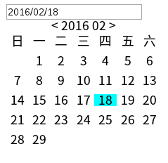

# vue-calendar

> A style-uninstallable datepicker component for Vue.js



## Requirement

- "vue": "^1.0.12"
- "moment": "^2.11.2"

## Usage

```html
<calendar :date.sync="dateString" format="YYYY/MM/DD"></calendar>
```
You can uninstall the preset style by pass a object which overrided the
class name of each block to classNames.

```html
<calendar :date.sync="dateString" :class-names="{panel: 'custom-panel'}"></calendar>
```

Then define your own style with new class name
```css
.custom-panel {
  // blablabla
}
```

The default class names (all of them can be overrided):

- root: 'calendar',
- input: 'calendar-input',
- panel: 'panel',
- box: 'box',
- bar: 'bar',
- day: 'day',
- month: 'month',
- year: 'year'

## License

[The MIT License](http://opensource.org/licenses/MIT)